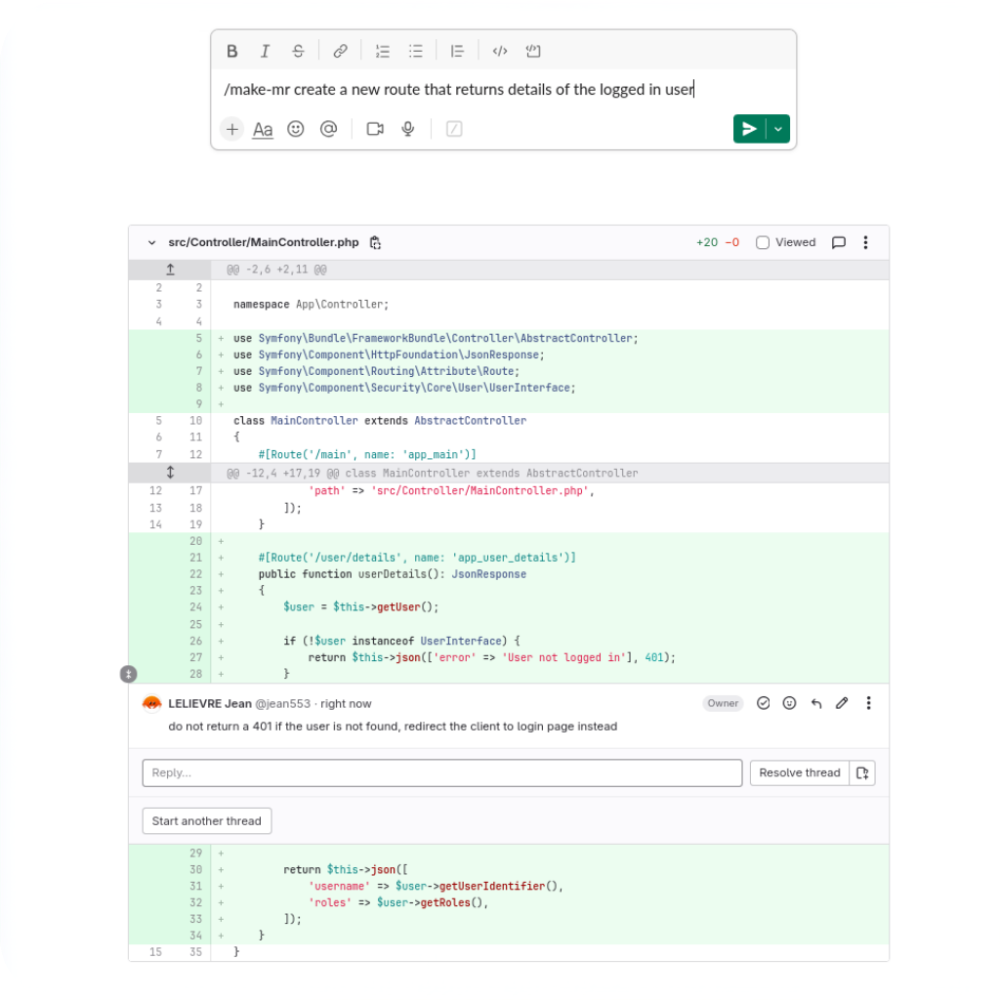

# Dev Intern AI

**Send Slack messages, get Merge Requests ! :rocket:**

**Go to #[dev-intern-ai.com](https://dev-intern-ai.com)**

## Connect your Gitlab project

Register into **Dev Intern AI** and set your Gitlab project ID. Invite the `dev-intern-ai` Gitlab user as a *developer* of your project and... voila ! You are ready to make your AI developer create Merge Requests based on your instructions.

## Send Slack messages 

Give instructions to your AI developer by sending messages into Slack. Use commands `/make-mr [instructions]` to create a brand new merge request based on your directives, or use `/edit-mr [instructions]` to request a modification of the lastest provided code.

Your AI developer will:
 * check code your codebase,
 * give you explanations through Slack,
 * push the modifications,
 * create a new Merge Request you can review

## Interact on the Merge Request

Request changes to your developer by adding comments directly on the provided Merge Request. Put Gitlab comments at the exact location in the code where you except the change and let your developer pushes again the modification.

## How to register ?

**Dev Intern AI** exclusively works with Slack for now. Simply go #[here](https://dev-intern-ai.com) and link your workspace.

Please send an email to `contact@dev-intern-ai.com` to enable your account.

:warning: Dev Intern AI is an early stage project. Please read carefully the privacy policy, terms of use and how the linked code base is handled.
