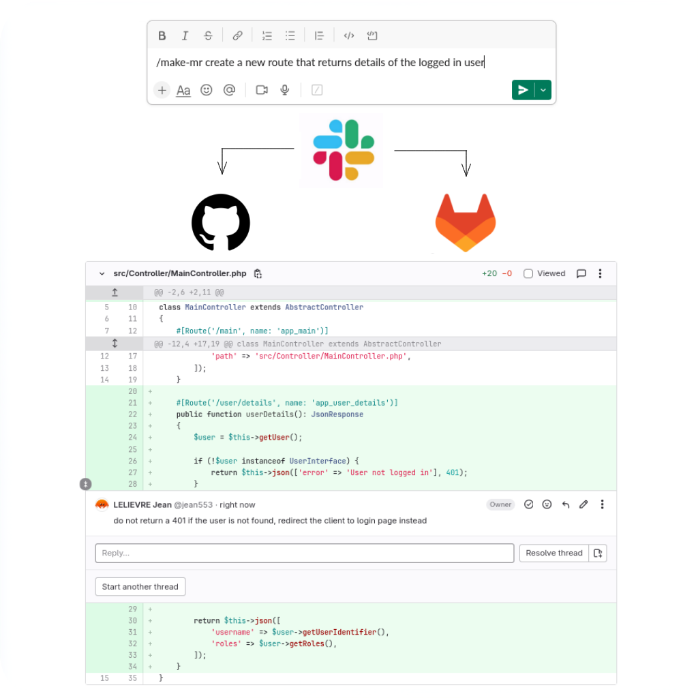

# Dev Intern AI

<strong>Send Slack messages, get Merge Requests! :rocket:</strong>

<strong>Go to [dev-intern-ai.com](https://dev-intern-ai.com) to start</strong>

<strong>:loudspeaker: Tests and feedbacks more than welcome ! (and actually needed and expected :stuck_out_tongue:) :loudspeaker:</strong>

<strong>Contact me at contact@dev-intern-ai.com and I will help you configure the tool !</strong>

## Connect your GitLab project

Register with **Dev Intern AI** and set your GitLab or GitHub project ID. Invite the `dev-intern-ai` GitLab user as a *developer* of your project and... voila! You are ready to have your AI developer create Merge Requests based on your instructions.

## Send Slack messages 

Give instructions to your AI developer by sending messages in Slack. Use the command `/make-mr [instructions]` to create a brand new merge request based on your directives, or use `/edit-mr [instructions]` to request modifications to the latest provided code.

Your AI developer will:
 * check your codebase,
 * provide explanations through Slack,
 * push the modifications,
 * and create a new Merge Request for you to review.

## Interact on the Merge Request

Request changes from your developer by adding comments directly on the provided Merge Request. Place GitLab comments at the exact location in the code where you expect the change, and let your developer push the modification again.

## How to register?

**Dev Intern AI** currently works exclusively with Slack. Simply go [here](https://dev-intern-ai.com) and link your workspace. You can also join the public workspace.

Please send an email to `contact@dev-intern-ai.com` to enable your account.
